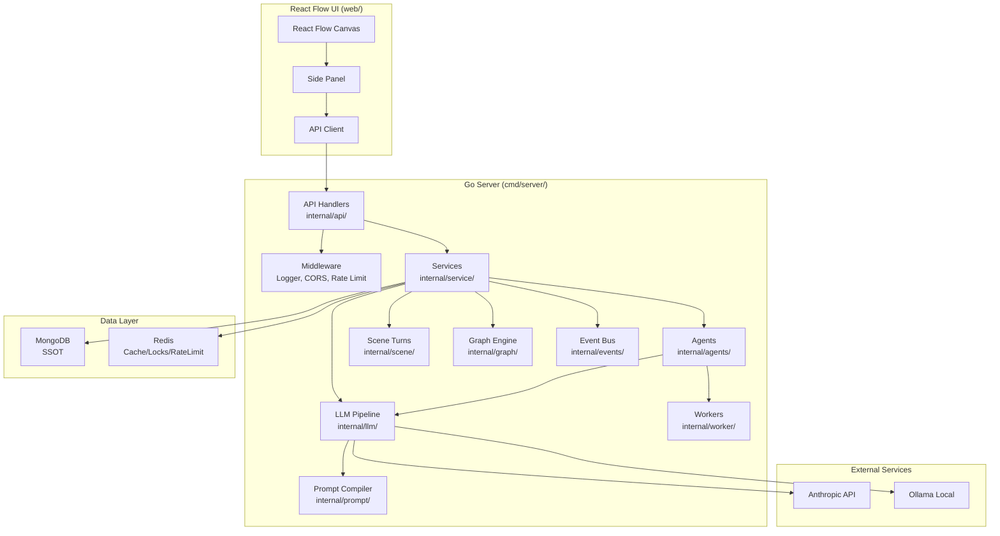
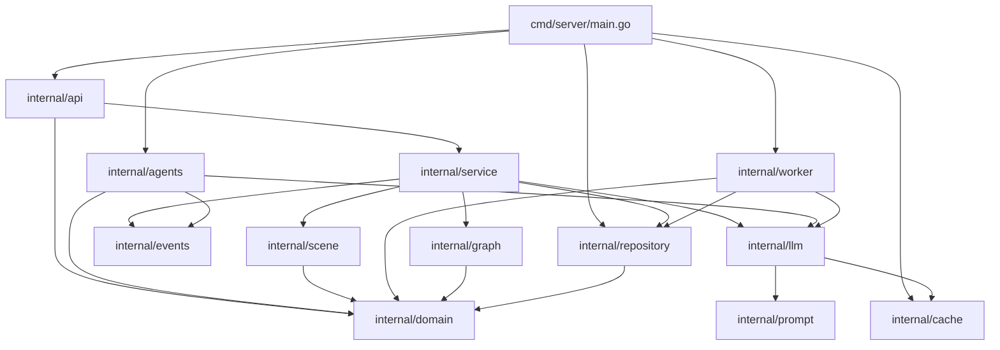
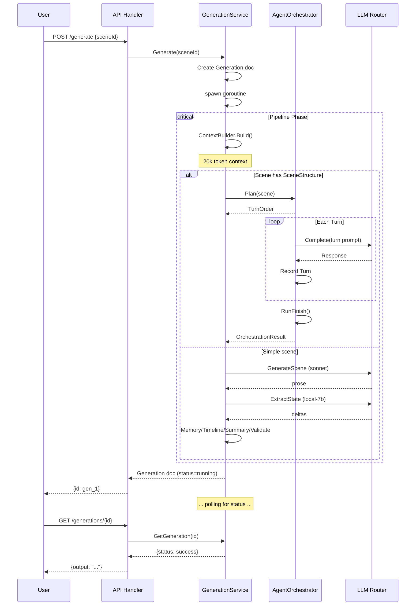
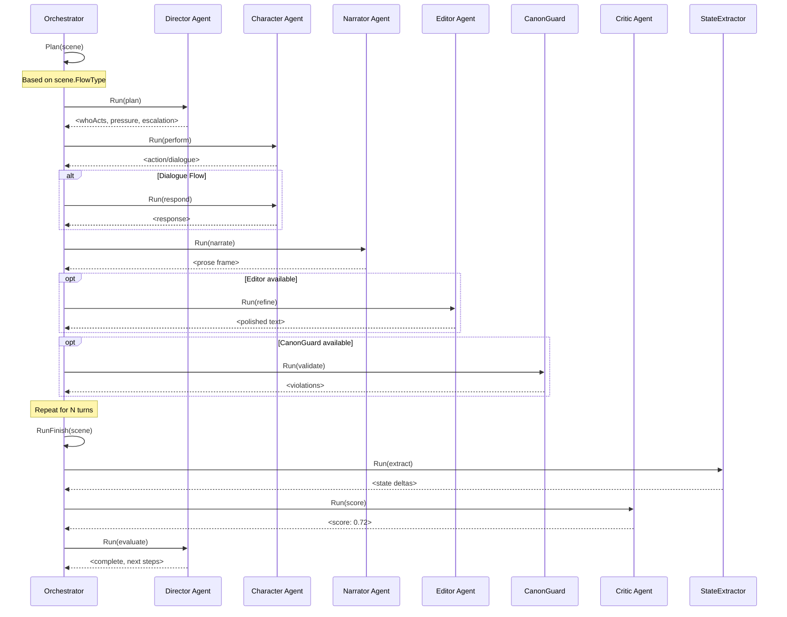
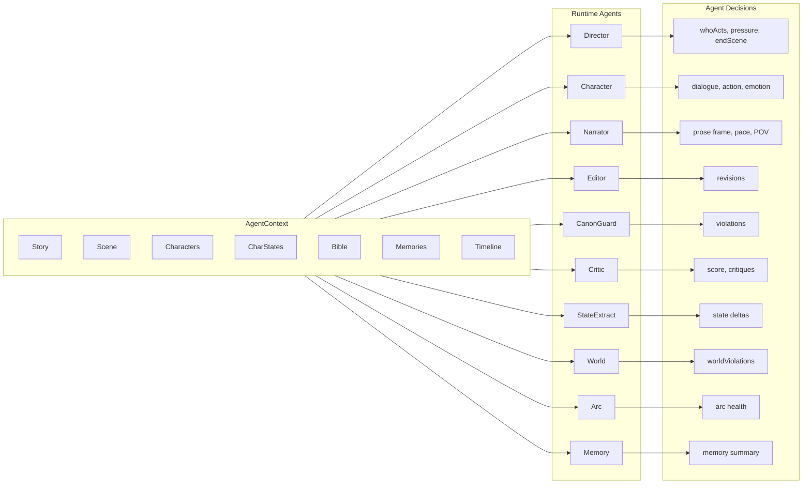
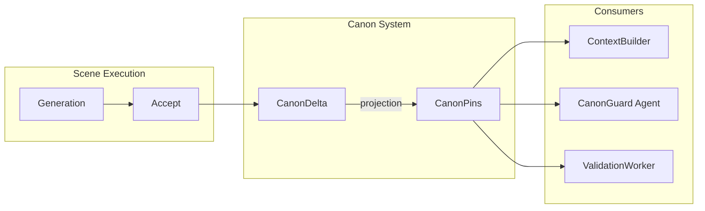
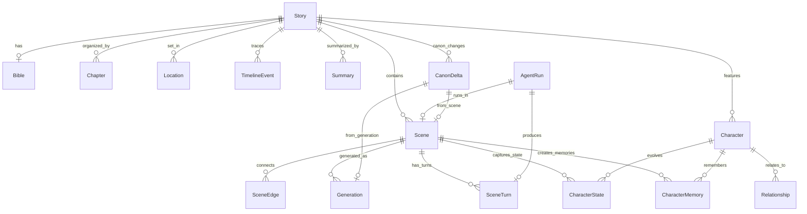

# Architecture Overview

## System Context Diagram

## Package Dependency Graph

## Scene Generation Flow

## Agent Turn Sequence

## Agent Data Flow

## Canon Versioning Flow

## Data Model: Story Entity Relationships

