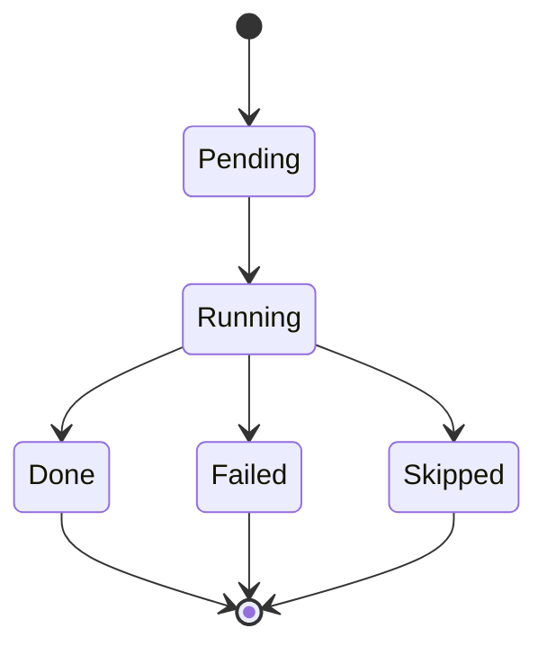
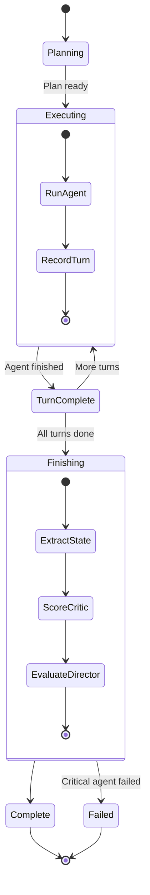

# Scene Orchestration

## Pipeline vs Agent Orchestration Decision

```mermaid
graph TD
    START[User triggers Generate] --> CHECK{Scene has<br/>SceneStructure?}
    CHECK -->|No| PIPELINE[Run 6-worker pipeline]
    CHECK -->|Yes| AGENT[Run agent orchestrator]

    PIPELINE --> G[1. Generate (sonnet)]
    PIPELINE --> E[2. Extract (local-7b)]
    PIPELINE --> M[3. Memory]
    PIPELINE --> T[4. Timeline]
    PIPELINE --> S[5. Summary]
    PIPELINE --> V[6. Validate (haiku)]

    AGENT --> PLAN[Orchestrator.Plan]
    PLAN --> EXEC[Orchestrator.Execute]
    EXEC --> FINISH[Orchestrator.RunFinish]
```

## Turn States



## Agent Orchestrator State Machine



## FlowType → Turn Order Mapping

```mermaid
graph TD
    subgraph Monologue["monologue"]
        D1[Director: plan] --> C1[Character: perform]
        C1 --> N1[Narrator: narrate]
        N1 --> E1[Editor: refine]
        E1 --> G1[CanonGuard: validate]
    end

    subgraph Dialogue["dialogue"]
        D2[Director: plan] --> C2a[Character 1: perform]
        C2a --> C2b[Character 2: respond]
        C2b --> N2[Narrator: narrate]
        N2 --> E2[Editor: refine]
        E2 --> G2[CanonGuard: validate]
    end

    subgraph RoundRobin["round_robin"]
        D3[Director: plan] --> C3[Character ×N: perform]
        C3 --> N3[Narrator: narrate]
        N3 --> G3[CanonGuard: validate-step]
        G3 --> LOOP{more turns?}
        LOOP -->|yes| C3
        LOOP -->|no| DONE[scene text]
    end

    subgraph Action["action"]
        D4[Director: plan] --> C4[Character: act]
        C4 --> N4[Narrator: describe]
        N4 --> E4[Editor: pace]
    end

    subgraph Silent["silent"]
        D5[Director: plan] --> N5[Narrator: describe]
    end
```


